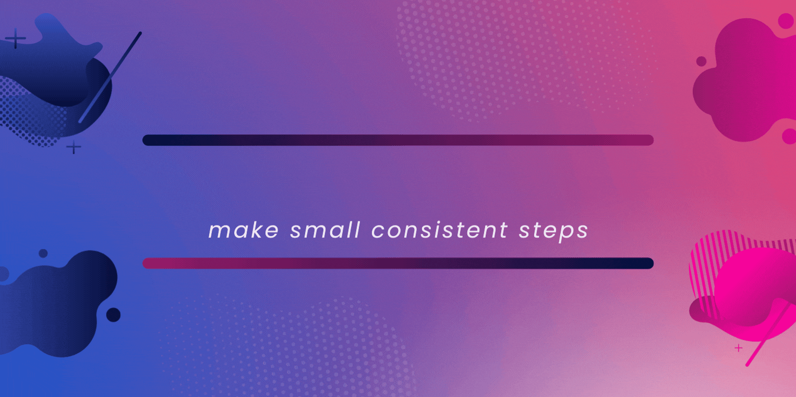

<h2 align="center">Hi, I'm Jeff Lai  </h2>
 

<h2 align="center"></h2>

<h2>About me</h2>

I am Jeff Lai, currently a undergraduate in Design and Artificial Intelligence, working as a software engineer in defi space [LinkedIn](https://www.linkedin.com/in/pin-nean-lai/). I am very keen to learn new technologies and use them to either create something useful or improve the existing softwares.   
⚡ Fun fact: I love to give people a drawing of themselves. I also like to connect with people and learn about their journey, openning up my mind for different perspectives on various domains.   
💬 Ask me anything, I will be more than happy to help :D
<h3>Summary</h3>

<h2>🛠Tech Stack</h2>

Languages  

Frameworks, Platforms and Libraries  

